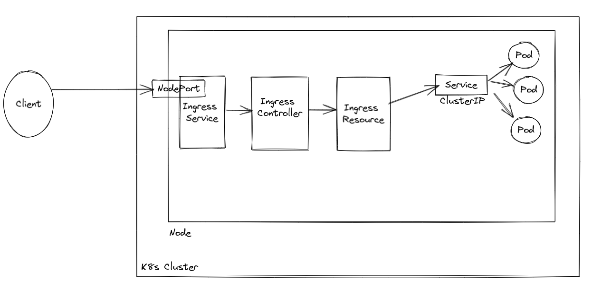

# K8S & ARGOCD

Run the following shell scripts:

1. 01-create-cluster-minikube.sh

2. 02-install-configure-argocd.sh

### Resources:

1. Argo CD - Declarative GitOps CD for Kubernetes - https://argo-cd.readthedocs.io/en/stable/
2. DevOps Catalog, Patterns, And Blueprints - https://www.udemy.com/course/devops-catalog/ - Victor Farcic

